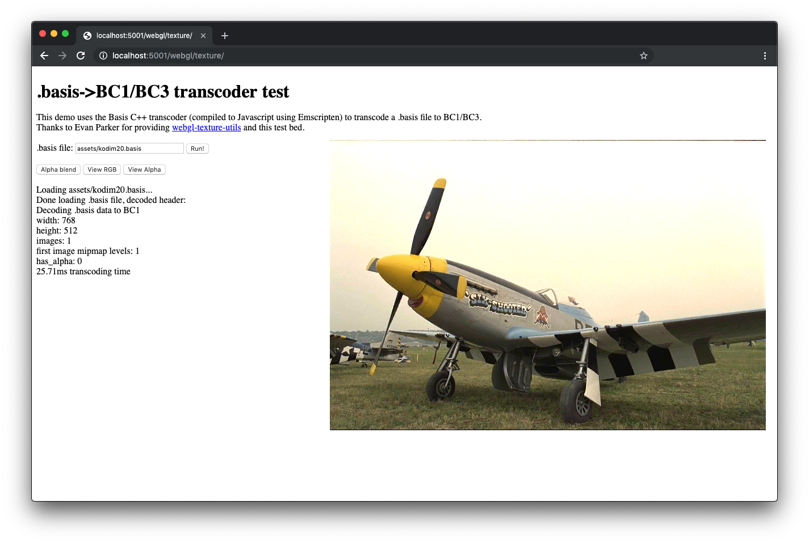
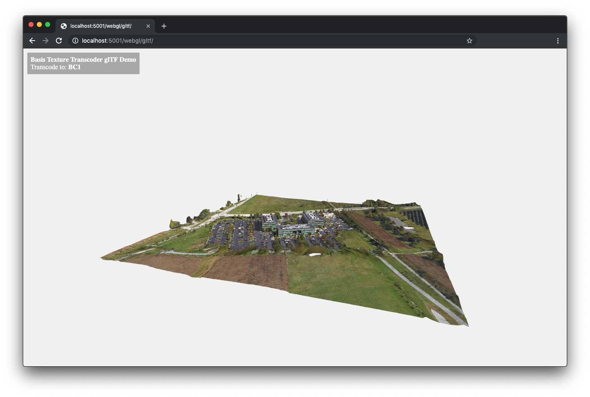

# basis_universal
An LDR/HDR portable GPU compressed texture transcoding system.

[](https://ci.appveyor.com/project/BinomialLLC/basis-universal)

----

Intro
-----

Basis Universal is an open source [supercompressed](http://gamma.cs.unc.edu/GST/gst.pdf) LDR/HDR GPU compressed texture interchange system from Binomial LLC that supports two intermediate file formats: the [.KTX2 open standard from the Khronos Group](https://registry.khronos.org/KTX/specs/2.0/ktxspec.v2.html), and our own ".basis" file format. These file formats support rapid transcoding to virtually any compressed [GPU texture format](https://en.wikipedia.org/wiki/Texture_compression) released in the past ~25 years. 

Our overall goal with this project is to simplify the encoding and efficient distribution of *portable* LDR and HDR GPU texture, image, and short texture video content in a way that is compatible with any GPU or rendering/graphics API.

The system supports five modes: ETC1S, UASTC LDR 4x4, UASTC HDR 4x4, UASTC HDR 6x6 (with or without RDO), or UASTC HDR 6x6 Intermediate ("GPU Photo"). The C/C++ encoder and transcoder libaries can be compiled to native code or WebAssembly, and all encoder/transcoder features can be accessed from Javascript via a C++ wrapper library which optionally supports [WASM multithreading](https://web.dev/articles/webassembly-threads) for fast encoding in the browser.

Links
-----

- [Release Notes](https://github.com/BinomialLLC/basis_universal/wiki/Release-Notes)

- [Live Encoder/Transcoder WebGL Examples](https://subquantumtech.com/bu_6x6/)

- [Javascript API/WASM/WebGL info](https://github.com/BinomialLLC/basis_universal/tree/master/webgl)

- [UASTC HDR 4x4 Example Images](https://github.com/BinomialLLC/basis_universal/wiki/UASTC-HDR-Examples)

### UASTC 6x6 HDR Specific Links:

- [UASTC HDR 6x6 Example Images](https://github.com/BinomialLLC/basis_universal/wiki/ASTC-HDR-6x6-Example-Images)

- [UASTC HDR 6x6 Support Nodes](https://github.com/BinomialLLC/basis_universal/wiki/UASTC-HDR-6x6-Support-Notes)

- [Quick comparison of ARM's astcenc HDR 6x6 encoder vs. ours](https://github.com/richgel999/junkdrawer/wiki/ASTC-6x6-HDR:-astcenc-%E2%80%90thorough-%E2%80%90exhausive-vs.-basis-universal-comp_level-3)

Supported LDR GPU Texture Formats
---------------------------------

ETC1S and UASTC LDR 4x4 files can be transcoded to:

- ASTC LDR 4x4 L/LA/RGB/RGBA 8bpp
- BC1-5 RGB/RGBA/X/XY
- BC7 RGB/RGBA
- ETC1 RGB, ETC2 RGBA, and ETC2 EAC R11/RG11
- PVRTC1 4bpp RGB/RGBA and PVRTC2 RGB/RGBA
- ATC RGB/RGBA and FXT1 RGB
- Uncompressed LDR raster image formats: 8888/565/4444

Supported HDR GPU Texture Formats
---------------------------------

UASTC HDR 4x4 and UASTC HDR 6x6 files can be transcoded to:
- ASTC HDR 4x4 (8bpp, UASTC HDR 4x4 only)
- ASTC HDR 6x6 RGB (3.56bpp, ASTC HDR 6x6 or UASTC HDR 6x6 intermediate only)
- BC6H RGB (8bpp, either UASTC HDR 4x4 or UASTC HDR 6x6)
- Uncompressed HDR raster image formats: RGB_16F/RGBA_16F (half float/FP16 RGB, 48 or 64bpp), or 32-bit/pixel shared exponent [RGB_9E5](https://registry.khronos.org/OpenGL/extensions/EXT/EXT_texture_shared_exponent.txt)

Supported Texture Compression Modes
-----------------------------------

1. [ETC1S](https://github.com/BinomialLLC/basis_universal/wiki/.basis-File-Format-and-ETC1S-Texture-Video-Specification): A roughly .3-3bpp low to medium quality supercompressed mode based off a subset of [ETC1](https://en.wikipedia.org/wiki/Ericsson_Texture_Compression) called "ETC1S". This mode supports variable quality vs. file size levels (like JPEG), alpha channels, built-in compression, and texture arrays optionally compressed as a video sequence using skip blocks ([Conditional Replenishment](https://en.wikipedia.org/wiki/MPEG-1)). This mode can be rapidly transcoded to all of the supported LDR texture formats.

2. [UASTC LDR 4x4](https://github.com/BinomialLLC/basis_universal/wiki/UASTC-LDR-4x4-Texture-Specification): An 8 bits/pixel LDR high quality mode. UASTC LDR is a 19 mode subset of the standard [ASTC LDR](https://en.wikipedia.org/wiki/Adaptive_scalable_texture_compression) 4x4 (8bpp) texture format, but with a custom block format containing transcoding hints. Transcoding UASTC LDR to ASTC LDR and BC7 are particularly fast and simple, because UASTC LDR is a common subset of both BC7 and ASTC. The transcoders for the other texture formats are accelerated by several format-specific hint bits present in each UASTC LDR block.

This mode supports an optional [Rate-Distortion Optimizated (RDO)](https://en.wikipedia.org/wiki/Rate%E2%80%93distortion_optimization) post-process stage that conditions the encoded UASTC LDR texture data in the .KTX2/.basis file so it can be more effectively LZ compressed. More details [here](https://github.com/BinomialLLC/basis_universal/wiki/UASTC-implementation-details).

Here is the [UASTC LDR 4x4 specification document](https://github.com/BinomialLLC/basis_universal/wiki/UASTC-LDR-4x4-Texture-Specification).

3. [UASTC HDR 4x4](https://github.com/BinomialLLC/basis_universal/wiki/UASTC-HDR-4x4-Texture-Specification-v1.0): An 8 bits/pixel HDR high quality mode. This is a 24 mode subset of the standard [ASTC HDR](https://en.wikipedia.org/wiki/Adaptive_scalable_texture_compression) 4x4 (8bpp) texture format. It's designed to be high quality, supporting the 27 partition patterns in common between BC6H and ASTC, and fast to transcode with very little loss (typically a fraction of a dB PSNR) to the BC6H HDR texture format. Notably, **UASTC HDR 4x4 data is 100% standard ASTC texture data**, so no transcoding at all is required on devices or API's supporting ASTC HDR. This mode can also be transcoded to various 32-64bpp uncompressed HDR texture/image formats.

Here is the [UASTC HDR 4x4 specification document](https://github.com/BinomialLLC/basis_universal/wiki/UASTC-HDR-4x4-Texture-Specification-v1.0), and here are some compressed [example images](https://github.com/BinomialLLC/basis_universal/wiki/UASTC-HDR-Examples).

4. UASTC HDR 6x6 or RDO UASTC HDR 6x6: A 3.56 bits/pixel (or less with RDO+Zstd) HDR high quality mode. Just like mode #3, **UASTC HDR 6x6 data is 100% standard ASTC texture data**. Here's a [page with details](https://github.com/BinomialLLC/basis_universal/wiki/UASTC-HDR-6x6-Support-Notes). The current encoder supports weight grid upsampling, 1-3 subsets, single or dual planes, CEM's 7 and 11, and all unique ASTC partition patterns.

5. UASTC HDR 6x6 Intermediate ("GPU Photo"): A custom compressed intermediate format that can be rapidly transcoded to ASTC HDR 6x6, BC6H, and various uncompressed HDR formats. The custom compressed file format is [described here](https://github.com/BinomialLLC/basis_universal/wiki/UASTC-HDR-6x6-Intermediate-File-Format-(Basis-GPU-Photo-6x6)). The format supports 75 unique ASTC configurations, weight grid upsampling, 1-3 subsets, single or dual planes, CEM's 7 and 11, and all unique ASTC partition patterns.

Notes:  
- Modes #3 and #4 output 100% standard or plain ASTC texture data (with or without RDO), like any other ASTC encoder. The .KTX2 files are just plain textures.
- The other modes (#1, #2, #5) output compressed data in various custom formats, which our transcoder library can convert in real-time to various GPU texture or pixel formats.
- Modes #4 and #5 internally use the same unified HDR 6x6 encoder.

### Other Features

Both .basis and .KTX2 files support mipmap levels, texture arrays, cubemaps, cubemap arrays, and texture video, in all five modes. Additionally, .basis files support non-uniform texture arrays, where each image in the file can have a different resolution or number of mipmap levels.

In ETC1S mode, the compressor is able to exploit color and pattern correlations across all the images in the entire file using global endpoint/selector codebooks, so multiple images with mipmaps can be stored efficiently in a single file. The ETC1S mode also supports skip blocks (Conditional Replenishment) for short video sequences, to prevent sending blocks which haven't changed relative to the previous frame.

The LDR image formats supported for reading are .PNG, [.DDS with mipmaps](https://learn.microsoft.com/en-us/windows/win32/direct3ddds/dx-graphics-dds-pguide), .TGA, .QOI, and .JPG. The HDR image formats supported for reading are .EXR, .HDR, and .DDS with mipmaps. The library can write .basis, .KTX2, .DDS, .KTX (v1), .ASTC, .OUT, .EXR, and .PNG files.

The system now supports loading basic 2D .DDS files with optional mipmaps, but the .DDS file must be in one of the supported uncompressed formats: 24bpp RGB, 32bpp RGBA/BGRA, half-float RGBA, or float RGBA. Using .DDS files allows the user to control exactly how the mipmaps are generated before compression.

Building
--------

The encoding library and command line tool have no required 3rd party dependencies that are not already in the repo itself. The transcoder is a single .cpp source file (in `transcoder/basisu_transcoder.cpp`) which has no 3rd party dependencies.

We build and test under:
- Windows x86/x64 using Visual Studio 2019/2022, MSVC or clang
- Windows ARM using Visual Studio 2022 ARM v17.13.0 or later
- Mac OSX (M1) with clang v15.0
- Ubuntu Linux with gcc v11.4 or clang v14
- Arch Linux ARM, on a [Pinebook Pro](https://pine64.org/devices/pinebook_pro/), with gcc v12.1.

Under Windows with Visual Studio you can use the included `basisu.sln` file. Alternatively, you can use cmake to create new VS solution/project files.

To build, first [install cmake](https://cmake.org/), then:

```
mkdir build
cd build
cmake ..
make
```

To build with SSE 4.1 support on x86/x64 systems (encoding is roughly 15-30% faster), add `-DSSE=TRUE` to the cmake command line. Add `-DOPENCL=TRUE` to build with (optional) OpenCL support. Use `-DCMAKE_BUILD_TYPE=Debug` to build in debug. To build 32-bit executables, add `-DBUILD_X64=FALSE`.

After building, the native command line tool used to create, validate, and transcode/unpack .basis/.KTX2 files is `bin/basisu`.

### Testing the Codec

The command line tool includes some automated LDR/HDR encoding/transcoding tests:

```
cd ../bin
basisu -test
basisu -test_hdr_4x4
basisu -test_hdr_6x6
basisu -test_hdr_6x6i
```

To test the codec in OpenCL mode (must have OpenCL libs/headers/drivers installed and have compiled OpenCL support in by running cmake with `-DOPENCL=TRUE`):

```
basisu -test -opencl
```

Compressing and Unpacking .KTX2/.basis Files
--------------------------------------------

- To compress an LDR sRGB PNG/QOI/TGA/JPEG/DDS image to an ETC1S .KTX2 file, at quality level 255 (the highest):

`basisu -q 255 x.png`

- For a linear LDR image, in ETC1S mode, at default quality (128):

`basisu -linear x.png`

- To compress to UASTC LDR, which is much higher quality than ETC1S:

`basisu -uastc x.png`

- To compress an [.EXR](https://en.wikipedia.org/wiki/OpenEXR), [Radiance .HDR](https://paulbourke.net/dataformats/pic/), or .DDS HDR image to a UASTC HDR 4x4 .KTX2 file:

`basisu x.exr`

- To compress an HDR 6x6 file:

```
basisu -hdr_6x6 x.exr  
basisu -hdr_6x6 -lambda 500 x.exr  
basisu -hdr_6x6_level 5 -lambda 500 x.exr
```

- To compress an HDR 6x6 file using the compressed intermediate format for smaller files:

```
basisu -hdr_6x6i x.exr  
basisu -hdr_6x6i -lambda 500 x.exr  
basisu -hdr_6x6i_level 5 -lambda 500 x.exr
```

Note the .EXR reader we're using is [TinyEXR's](https://github.com/syoyo/tinyexr), which doesn't support all possible .EXR compression modes. Tools like [ImageMagick](https://imagemagick.org/) can be used to create .EXR files that TinyEXR can read.

Alternatively, LDR images (such as .PNG) can be compressed to an HDR format by specifying `-hdr`, `-hdr_6x6`, or `-hdr_6x6i`. By default LDR images, when compressed to an HDR format, are first upconverted to HDR by converting them from sRGB to linear light and scaled to 100 [nits](https://en.wikipedia.org/wiki/Candela_per_square_metre) (candelas per square meter). The sRGB conversion step can be disabled by specifying `-hdr_ldr_no_srgb_to_linear`, and the normalized RGB linear light to nit multiplier can be changed by specifying `-hdr_ldr_upconversion_nit_multiplier X`.

Note: If you're compressing LDR/SDR image files to an HDR format, the codec's default behavior is to convert the 8-bit image data to linear light (by undoing the sRGB transfer function). It then  multiplies the linear light RGB values by the LDR->HDR upconversion multiplier, which is in [nits (candela per sq. meter)](https://en.wikipedia.org/wiki/Candela_per_square_metre). In previous versions of the codec, this multiplier was effectively 1 nit, but it now defaults to 100 nits in all modes. (The typical luminance of LDR monitors is 80-100 nits.) To change this, use the "-hdr_ldr_upconversion_nit_multiplier X" command line option. (This is done because the HDR 6x6 codecs function internally in the [ICtCp HDR colorspace](https://en.wikipedia.org/wiki/ICtCp). LDR/SDR images must be upconverted to linear light HDR images scaled to a proper max. luminance based off how the image data will be displayed on actual SDR/HDR monitors.)

### Some Useful Command Line Options

- `-fastest` (which is equivalent to `-uastc_level 0`) puts the UASTC LDR/HDR encoders in their fastest (but lower quality) modes. 

- `-slower` puts the UASTC LDR/HDR encoders in higher quality but slower modes (equivalent to `-uastc_level 3`). The default level is 1, and the highest is 4 (which is quite slow).

- `-q X`, where X ranges from [1,255], controls the ETC1S mode's quality vs. file size tradeoff level. 255 is the highest quality, and the default is 128.

- `-debug` causes the encoder to print internal and developer-oriented verbose debug information.

- `-stats` to see various quality (PSNR) statistics. 

- `-linear`: ETC1S defaults to sRGB colorspace metrics, UASTC LDR currently always uses linear metrics, and UASTC HDR defaults to weighted RGB metrics (with 2,3,1 weights). If the input is a normal map, or some other type of non-sRGB (non-photographic) texture content, be sure to use `-linear` to avoid extra unnecessary artifacts. (Angular normal map metrics for UASTC LDR/HDR are definitely doable and on our TODO list.)

- Specifying `-opencl` enables OpenCL mode, which currently only accelerates ETC1S encoding.

- The compressor is multithreaded by default, which can be disabled using the `-no_multithreading` command line option. The transcoder is currently single threaded, although it is thread safe (i.e. it supports decompressing multiple texture slices in parallel).

More Example Command Lines
--------------------------

- To compress an sRGB PNG/QOI/TGA/JPEG/DDS image to an RDO (Rate-Distortion Optimization) UASTC LDR .KTX2 file with mipmaps:

`basisu -uastc -uastc_rdo_l 1.0 -mipmap x.png`

`-uastc_rdo_l X` controls the RDO ([Rate-Distortion Optimization](https://en.wikipedia.org/wiki/Rate%E2%80%93distortion_optimization)) quality setting. The lower this value, the higher the quality, but the larger the compressed file size. Good values to try are between .2-3.0. The default is 1.0.

- To add automatically generated mipmaps to a ETC1S .KTX2 file, at a higher than default quality level (which ranges from [1,255]):

`basisu -mipmap -q 200 x.png`

There are several mipmap options to change the filter kernel, the filter colorspace for the RGB channels (linear vs. sRGB), the smallest mipmap dimension, etc. The tool also supports generating cubemap files, 2D/cubemap texture arrays, etc. To bypass the automatic mipmap generator, you can create LDR or HDR uncompressed [.DDS texture files](https://learn.microsoft.com/en-us/windows/win32/direct3ddds/dx-graphics-dds-pguide) and feed them to the compressor.

- To create a slightly higher quality ETC1S .KTX2 file (one with higher quality endpoint/selector codebooks) at the default quality level (128) - note this is much slower to encode:

`basisu -comp_level 2 x.png`

On some rare images (ones with blue sky gradients come to bind), you may need to increase the ETC1S `-comp_level` setting, which ranges from 1,6. This controls the amount of overall effort the encoder uses to optimize the ETC1S codebooks and the compressed data stream. Higher comp_level's are *significantly* slower. 

- To manually set the ETC1S codebook sizes (instead of using -q), with a higher codebook generation level (this is useful with texture video):

`basisu x.png -comp_level 2 -max_endpoints 16128 -max_selectors 16128`

- To [tonemap](https://en.wikipedia.org/wiki/Tone_mapping) an HDR .EXR or .HDR image file to multiple LDR .PNG files at different exposures, using the Reinhard tonemap operator:

`basisu -tonemap x.exr`

- To compare two LDR images and print PSNR statistics:

`basisu -compare a.png b.png`

- To compare two HDR .EXR/.HDR images and print FP16 PSNR statistics:

`basisu -compare_hdr a.exr b.exr`

See the help text for a complete listing of the tool's command line options. The command line tool is just a thin wrapper on top of the encoder library.

Unpacking .KTX2/.basis files to .PNG/.EXR/.KTX/.DDS files
---------------------------------------------------------

You can either use the command line tool or [call the transcoder directly](https://github.com/BinomialLLC/basis_universal/wiki/How-to-Use-and-Configure-the-Transcoder) from JavaScript or C/C++ code to decompress .KTX2/.basis files to GPU texture data or uncompressed image data. To unpack a .KTX2 or.basis file to multiple .png/.exr/.ktx/.dds files:

`basisu x.ktx2`

Use the `-no_ktx` and `-etc1_only`/`-format_only` options to unpack to less files. 

`-info` and `-validate` will just display file information and not output any files. 

The written mipmapped, cubemap, or texture array .KTX/.DDS files will be in a wide variety of compressed GPU texture formats (PVRTC1 4bpp, ETC1-2, BC1-5, BC7, etc.), and to our knowledge there is unfortunately (as of 2024) still no single .KTX or .DDS viewer tool that correctly and reliably supports every GPU texture format that we support. BC1-5 and BC7 files are viewable using AMD's Compressonator, ETC1/2 using Mali's Texture Compression Tool, and PVRTC1 using Imagination Tech's PVRTexTool. [RenderDoc](https://renderdoc.org/) has a useful texture file viewer for many formats. The Mac OSX Finder supports previewing .EXR and .KTX files in various GPU formats. The Windows 11 Explorer can preview .DDS files. The [online OpenHDR Viewer](https://viewer.openhdr.org/) is useful for viewing .EXR/.HDR image files. 

WebGL Examples
--------------

The 'WebGL' directory contains several simple WebGL demos that use the transcoder and compressor compiled to [WASM](https://webassembly.org/) with [emscripten](https://emscripten.org/). These demos are online [here](https://subquantumtech.com/uastchdr2/). See more details in the readme file [here](webgl/README.md).





Building the WASM Modules with [Emscripten](https://emscripten.org/) 
--------------------------------------------------------------------

Both the transcoder and encoder may be compiled using emscripten to WebAssembly and used on the web. A set of JavaScript wrappers to the codec, written in C++ with emscripten extensions, is located in `webgl/transcoding/basis_wrappers.cpp`. The JavaScript wrapper supports nearly all features and modes, including texture video. See the README.md and CMakeLists.txt files in `webgl/transcoder` and `webgl/encoder`. 

To build the WASM transcoder, after installing emscripten:

```
cd webgl/transcoder/build
emcmake cmake ..
make
```

To build the WASM encoder:

```
cd webgl/encoder/build
emcmake cmake ..
make
```

There are two simple encoding/transcoding web demos, located in `webgl/ktx2_encode_test` and `webgl/texture_test`, that show how to use the encoder's and transcoder's Javascript wrapper API's.

Low-level C++ Encoder/Transcoder API Examples
---------------------------------------------

Some simple examples showing how to directly call the C++ encoder and transcoder library API's are in [`example/examples.cpp`](https://github.com/BinomialLLC/basis_universal/blob/master/example/example.cpp).

ETC1S Texture Video Tips
------------------------

See the wiki [here](https://github.com/BinomialLLC/basis_universal/wiki/Encoding-ETC1S-Texture-Video-Tips).

Installation using the vcpkg dependency manager
-----------------------------------------------

You can download and install Basis Universal using the [vcpkg](https://github.com/Microsoft/vcpkg/) dependency manager:

    git clone https://github.com/Microsoft/vcpkg.git
    cd vcpkg
    ./bootstrap-vcpkg.sh
    ./vcpkg integrate install
    vcpkg install basisu

The Basis Universal port in vcpkg is kept up to date by Microsoft team members and community contributors. If the version is out of date, please [create an issue or pull request](https://github.com/Microsoft/vcpkg) on the vcpkg repository. (9/10/2024: UASTC HDR support is not available here yet.)

License
-------

The transcoder and core encoder libraries are Apache 2.0. The transcoder utilizes no 3rd party libraries or dependencies. See [LICENSE](https://github.com/BinomialLLC/basis_universal/blob/master/LICENSE).

The encoder library is Apache 2.0, but it utilizes some open source 3rd party modules (in 'encoder/3rdparty' and in the 'Zstd' directory) to load [.QOI](https://qoiformat.org/), [.DDS](https://github.com/DeanoC/tiny_dds), [.EXR](https://github.com/syoyo/tinyexr) images, to handle [Zstd](https://github.com/facebook/zstd) compression, and to unpack ASTC texture blocks. See the [LICENSES](https://github.com/BinomialLLC/basis_universal/tree/master/LICENSES) and [.reuse](https://github.com/BinomialLLC/basis_universal/blob/master/.reuse/dep5) folders.

Repository Licensing with REUSE
-------------------------------

The repository has been updated to be compliant with the REUSE license
checking tool (https://reuse.software/). See the `.reuse` subdirectory.

External Tool Links
-------------------

[Online .EXR HDR Image File Viewer](https://viewer.openhdr.org/)

[Windows HDR + WCG Image Viewer](https://13thsymphony.github.io/hdrimageviewer/) - A true HDR image viewer for Windows. Also see [the github repo](https://github.com/13thsymphony/HDRImageViewer).

[RenderDoc](https://renderdoc.org/)

[AMD Compressonator](https://gpuopen.com/gaming-product/compressonator/)

[Microsoft's DirectXTex](https://github.com/microsoft/DirectXTex)

[PVRTexTool](https://www.imgtec.com/developers/powervr-sdk-tools/pvrtextool/)

[Mali Texture Compression Tool](https://community.arm.com/support-forums/f/graphics-gaming-and-vr-forum/52390/announcement-mali-texture-compression-tool-end-of-life) - Now deprecated

For more useful links, papers, and tools/libraries, see the end of the [UASTC HDR texture specification](https://github.com/BinomialLLC/basis_universal/wiki/UASTC-HDR-Texture-Specification-v1.0).

----

E-mail: info @ binomial dot info, or contact us on [Twitter](https://twitter.com/_binomial)

Here's the [Sponsors](https://github.com/BinomialLLC/basis_universal/wiki/Sponsors-and-Supporters) wiki page.
