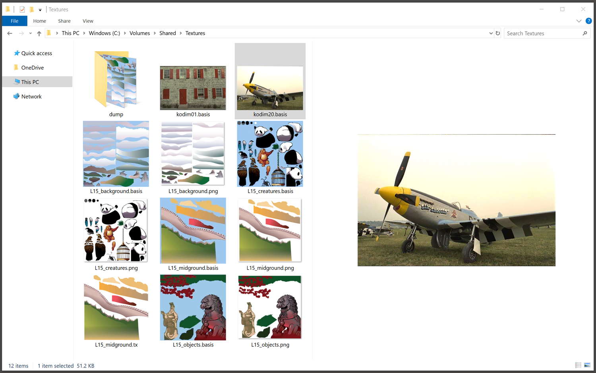

# Windows Previewers for Basis Universal

Build using Visual Studio from 2012 onwards (building with 2017 onwards needs the [optional MFC and ATL support adding](https://developercommunity.visualstudio.com/comments/11241/view.html) used for the details pane). Enable from an Administrator console using `regsvr32 previewers.dll` (and remove using `regsvr32 /u previewers.dll`).

Work-in-progress. Prebuilt signed version and installer coming soon. Mac version to follow.
