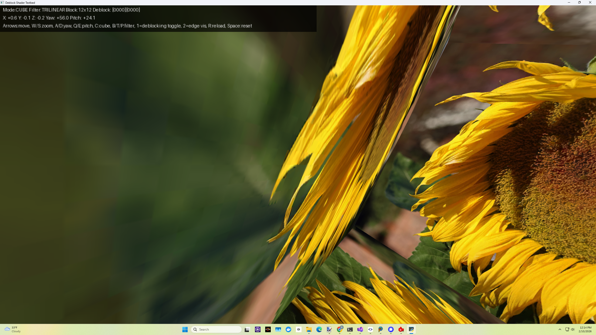
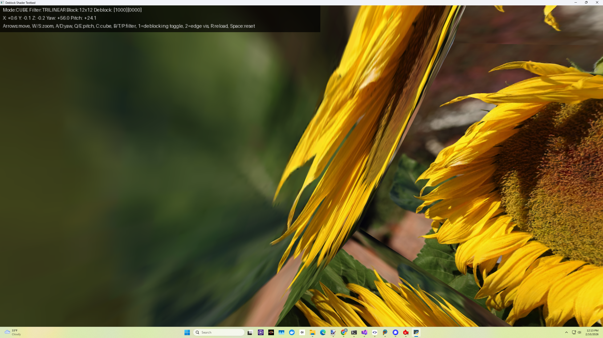
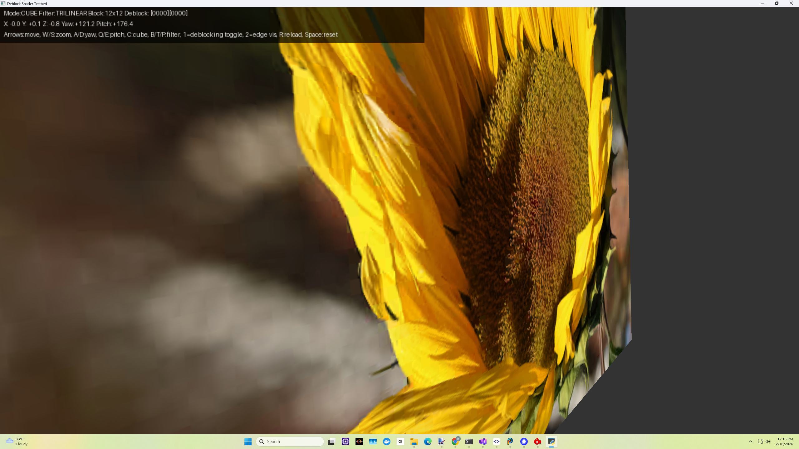
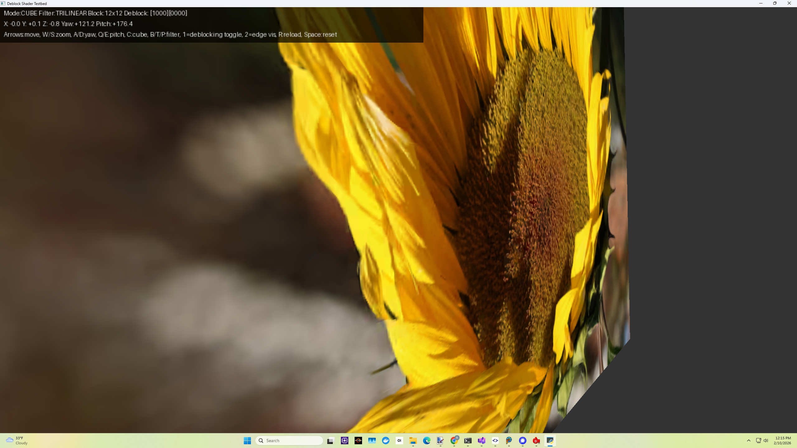
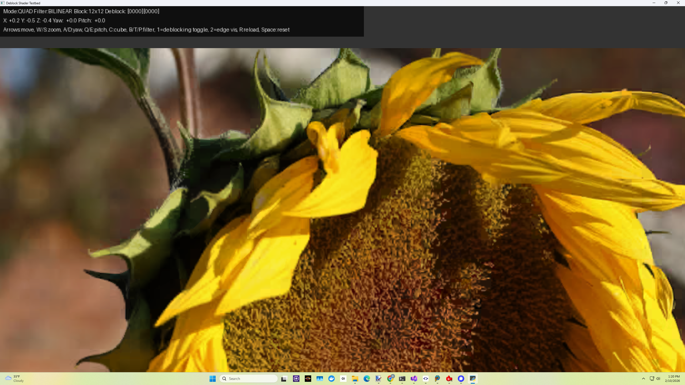
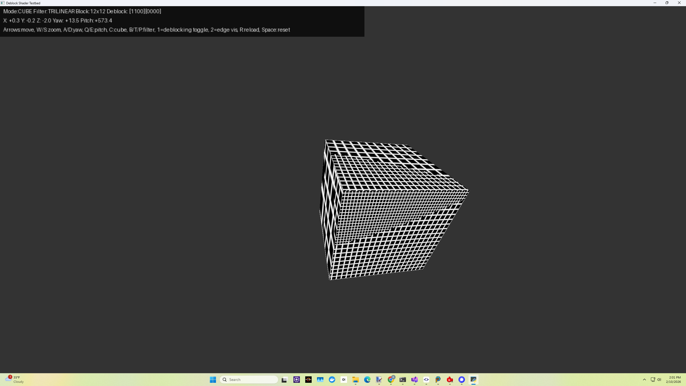
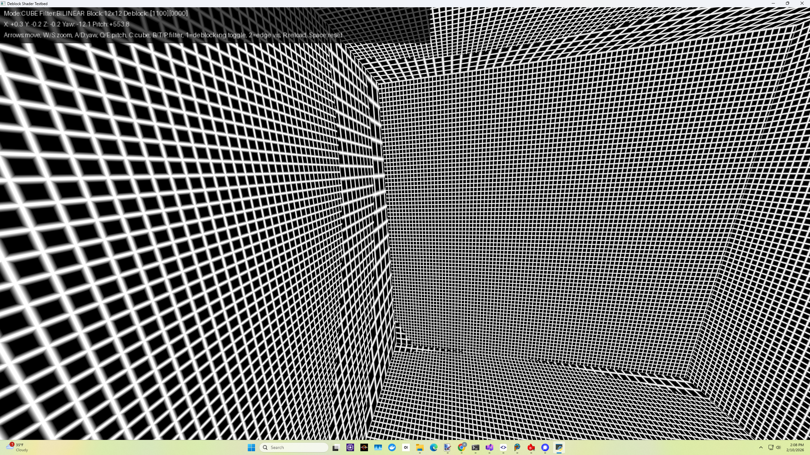

# Python+GLSL Shader Deblocking Sample

*Block boundaries are predictable.*

This sample demonstrates how to use a simple pixel shader to greatly reduce
ASTC texture block artifacts, which can be quite noticeable when the block size goes
beyond roughly 6x6. The basic idea: instead of always sampling the texture using 
a single tap, you instead sample the texture either one time or X times with a simple low pass filter,
depending on whether or not the sample location is near a block edge. The multiple filter taps around 
the center sample blur across block boundaries of ASTC compressed textures. There are two independent filters, for horizontal and vertical block boundaries.

The example shader is compatible with mipmapping, bilinear filtering, trilinear filtering etc. and is temporally stable. The 
shader smoothly lerps between no filtering and edge filtering, and is mipmap-aware by using the pixel shader derivative instructions. Crucially, the block lattice is evaluated in the *effective mip space*, not in base texture space, which is why it's mipmap-aware. The Python sample shows either a textured quad or a cube, with various controls to move the object, rotate the cube, toggle the deblocking shader on/off, change the texture filtering, etc.

The sample loads textures either directly from a Basis Universal `.KTX2` file — transcoding it to a GPU-compressed format (ASTC, BC7, or ETC2) and uploading the compressed mip levels — or from a set of `.PNG` mip levels (uncompressed RGBA8, for development/debugging). When loading a `.KTX2`, the deblock filter block size and whether to deblock are taken from the file's metadata.

It was written to be as simple as possible. The shader's filter coefficients were picked for more blurring vs. our CPU deblocker to demonstrate the effect, but they are easily tuned. The shader could easily be more optimized (most inner block texels don't need any filtering, but we don't exploit this in the shader with a conditional yet). The idea is compatible with other texture formats with noticeable block artifacts, such as BC1 or ETC1, but 4x4 blocks are so tiny it may be a wash.

It's also possible to add adaptivity to this shader, so it doesn't blindly blur across sharp edges - like we do while 
CPU deblocking before transcoding to BC7 or other LDR texture formats. It's also possible
to add deblocking filter awareness to our ASTC/XUASTC/etc. encoders.

The shader computes the mipmap LOD index assuming a full mip chain, then clamps it to `maxLod` (the number of loaded mip levels minus one), which the host passes in from the loaded `.KTX2` or `.PNG` set. This means partial chains (e.g. a single-level `.KTX2`) are sampled without reaching absent mip levels.

Note: We're amazed the GPU hardware vendors haven't implemented this feature directly in silicon yet. It's extremely useful, even necessary at the largest ASTC block sizes.
This is a form of "GPU texture compression-aware shading" or "GPU format-informed reconstruction".

## Running the Sample

You'll need these Python dependencies:
```
pip install numpy Pillow glfw PyOpenGL
```

You also need the **Basis Universal Python bindings** (`basisu_py`), which provide the transcoder used to load `.KTX2` files. This sample lives in `python/shader_deblocking/` inside the Basis Universal repo so that `basisu_py` (in `python/`) can be found; `testbed.py` adds the package to `sys.path` automatically by searching upward from its own location, so you can run it from its directory.

On **macOS** (and any platform without a prebuilt native transcoder binary), `basisu_py` uses its WebAssembly backend, which requires the `wasmtime` Python package:
```
pip install wasmtime
```

You may also want "PyOpenGL_accelerate", and under Linux you may need the system package "libglfw3". We developed this sample under Windows 11.

The sample loads textures two ways:

The shader is always loaded from `shader.glsl` in the current directory, so it is not passed on the command line.

**1. Directly from a `.KTX2` file (recommended):**
```
python testbed.py kodim26_12x12.ktx2
```
The transcoder opens the `.KTX2`, the sample picks a GPU-compressed format and uploads all mip levels (see "KTX2 Loading" below), and the deblock filter block size and on/off state come from the file's metadata.

**2. From one or more `.PNG` mip levels (development/debugging):**
```
python testbed.py 12 12 mip0.png mip1.png [mip2.png ...]
```
PNGs are uploaded as uncompressed 32bpp RGBA8. The two integers are the deblock filter block size in texels (e.g. `12 12`); deblocking defaults to off (press `1`).

Depending on your setup you may need to use `python3`, or `py -3.12`, etc.

Keys: `1` toggles the deblocking shader, `2` toggles the edge visualization (only shows when deblocking is enabled), arrow keys move the object, `W`/`S`: forward/backward, `A`/`D`/`Q`/`E`: yaw/pitch, `C`: toggle cube vs. quad. (See the source code remarks and the Controls section below.)

The shader can be easily simplified to sample the texture less by using fewer taps. The current shader uses 5 taps (the center sample plus its 4 axis neighbors).

Many variations and optimizations of this basic idea are possible. *Now shader engineers can directly impact memory consumption.* The better your deblocking shaders are tuned or your specific content, the bigger the ASTC block size you can ship. ASTC texture deblocking pixel shader engineering is now a memory optimization skill. 

---

## KTX2 Loading

When given a `.KTX2`, the sample inspects the file and selects a GPU-compressed texture format, preferring **ASTC**, then **BC7**, then **ETC2 RGBA**, based on which compressed-texture extensions the OpenGL/OpenGL ES/WebGL context advertises (e.g. `GL_KHR_texture_compression_astc_ldr`, `GL_ARB_texture_compression_bptc`, `GL_ARB_ES3_compatibility`, plus the GLES `OES`/WebGL `WEBGL_`/`EXT_` variants). If the GPU supports none of the three, the sample **falls back to uncompressed 32bpp RGBA8** — the transcoder transcodes each level to RGBA and it is uploaded with `glTexImage2D`, so a `.KTX2` always loads on any GL context. Compressed levels are uploaded via `glCompressedTexImage2D`, one call per mip level (each level at its original/unpadded width and height).

Note that ASTC is rarely exposed by *desktop* OpenGL drivers — it's mostly a mobile/GLES feature — so on a typical desktop GPU the sample selects BC7.

**Block size decoupling:** the deblocking filter always uses the *original* ASTC/XUASTC block size stored in the `.KTX2` (e.g. 12x12), independent of the GPU storage format's block size. The block artifacts are baked into the content by the original encode and survive a re-transcode to, say, BC7's 4x4 blocks — so the shader filters the original 12x12 lattice even when the texture is stored on the GPU as BC7.

**Deblocking metadata:** Basis Universal writes a `DeblockFilterID` key into the `.KTX2`, queried via `get_deblocking_filter_index()`. When it is 1, the sample enables shader deblocking by default (the `1` key still toggles it manually). Because the *GPU shader* performs the deblocking, the transcoder's own CPU deblocking is disabled during transcode (the `NO_DEBLOCK_FILTERING` decode flag) to avoid double-filtering.

The on-screen overlay's first line reports the source resolution, mip count, block size, `DeblockID`, and the `.KTX2` format (e.g. `XUASTC LDR 12x12`).

---

## Performance

The deblocking shader itself can be put inside a dynamic `if` conditional, so the extra ALU/texture ops only kick in near block edges (which are the minority of samples at ASTC 12x12). The extra sample taps are spatially always near the center sample, so they'll hit the texture cache most of the time. In texture bandwidth bound rendering scenarios (quite common on mobile platforms), the extra ALU ops for deblocking likely come for "free".

*Another perspective: The alternative to not deblocking is ~2x-8x more GPU memory bandwidth (and increased download size) to use smaller ASTC block sizes which have less noticeable block artifacts.*

---

## Screenshots - ASTC 12x12 Block Size

*Note: These screenshots are from our original deblocking filter experiments, before our encoder was modified to optimize globally for deblocking.*

**Disabled:**


**Enabled:**


---

**Disabled:**


**Enabled:**


---

**Disabled:**


**Enabled:**


---

**Block Edge Computation Visualization:**



These screenshots show how the pixel shader computes texture block boundaries in effective mipmap space. To see this visualization, press '1' to enable deblocking, then '2' to enable block edge visualization. Only white areas in this visualization are modified by this shader, leaving the inner block texels unmodified.

**Obviously, it's crucial that the deblock filter block size exactly matches the source ASTC/XUASTC block size, or the filtering won't align with the actual block artifacts. For `.KTX2` files this is read from the file automatically; for the `.PNG` path you pass it on the command line (e.g. `12 12`).**

---

## Usage and Controls

The sample either renders a single textured quad or a cube. Press 'C' to toggle between them. The '1' key toggles shader deblocking — it defaults to **on** for `.KTX2` files whose `DeblockFilterID` is 1, and **off** otherwise (including the `.PNG` path). The '2' key enables edge visualization, which only works when deblocking is enabled. Texture filtering defaults to **trilinear**; use `B`/`T`/`P` to switch to bilinear/trilinear/point.

Other keys can be used to move around the quad, rotate the cube etc.:

```
Usage:
    python testbed.py file.ktx2
    python testbed.py block_w block_h mip0.png [mip1.png ...]
    block_w, block_h: deblock filter block size in texels (PNG mode only, e.g. 12 12)
    The shader is always loaded from shader.glsl in the current directory.

Controls:
    Arrows      Move quad left/right/up/down
    W / S       Move closer / farther
    A / D       Rotate yaw (cube mode)
    Q / E       Rotate pitch (cube mode)
    C           Toggle cube / quad mode
    B           Bilinear filtering
    T           Trilinear filtering
    P           Point filtering
    R           Reload shader
    1           Toggle deblocking shader off/on  (const0.x)
    2           Toggle edge visualization         (const0.y; only when deblocking active)
    3 / 4       Toggle spare shader const0.z / const0.w (0 <-> 1)
    5-8         Toggle spare shader const1.x / y / z / w (0 <-> 1)
    Space       Reset to initial state
    Esc         Quit
```

---

## Credits

The included sunflower image is in the CC0/Public Domain, and was downloaded from here:

https://www.publicdomainpictures.net/en/view-image.php?image=756601&picture=large-yellow-sunflower

"License: CC0 Public Domain - Lynn Greyling has released this “Large Yellow Sunflower” image under Public Domain license."

