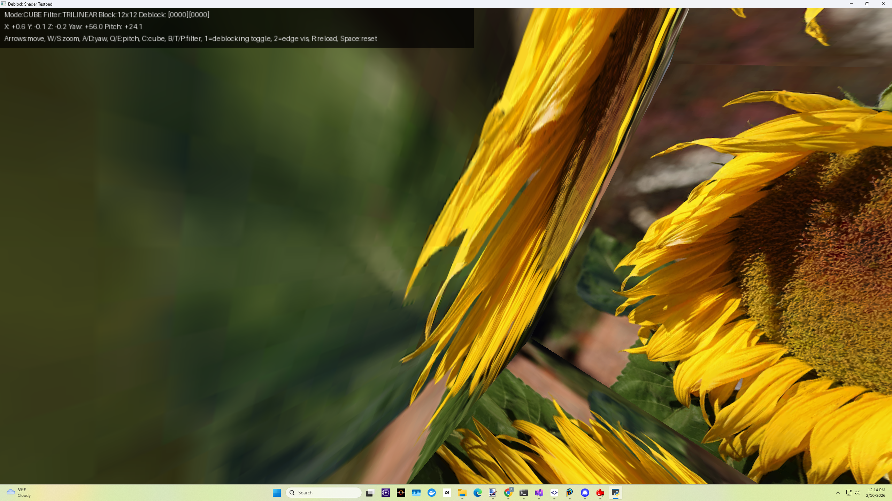
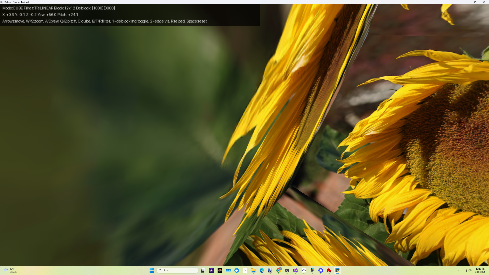
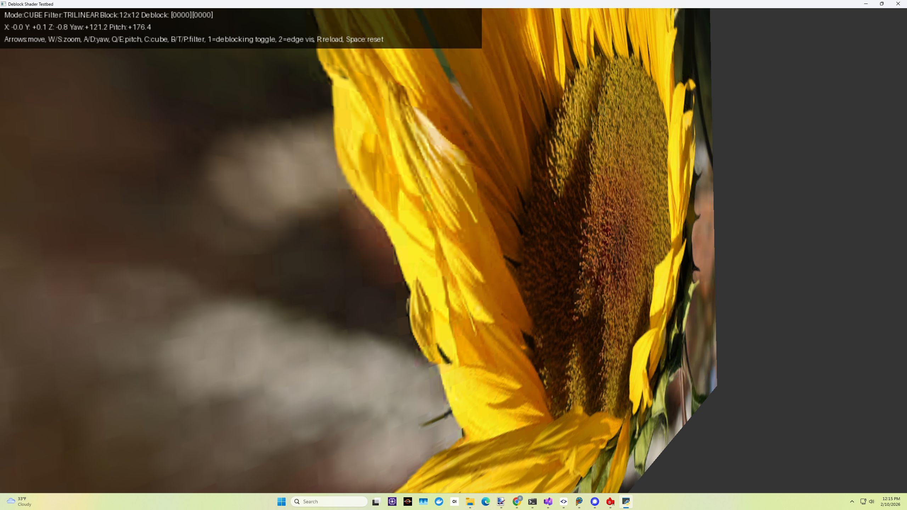
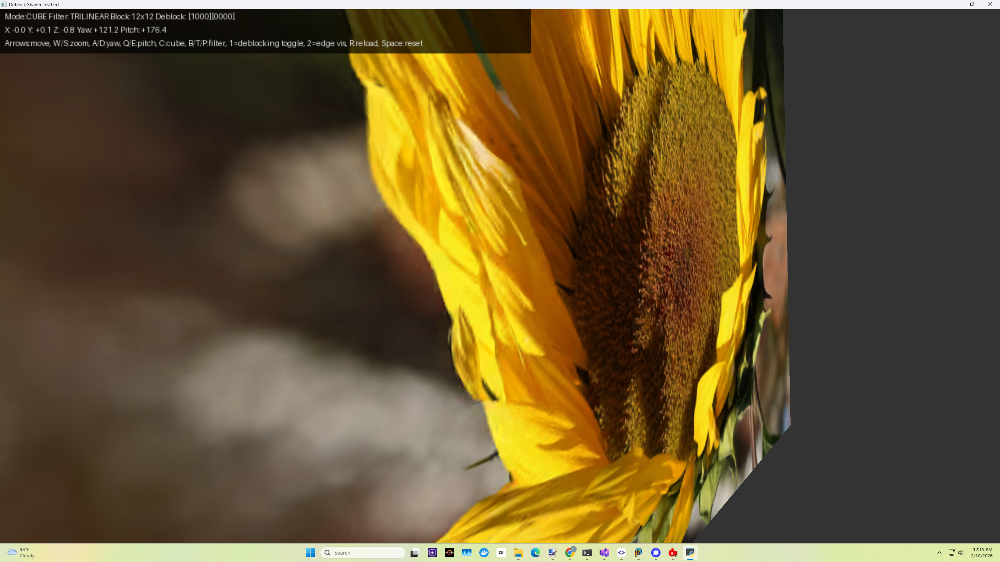
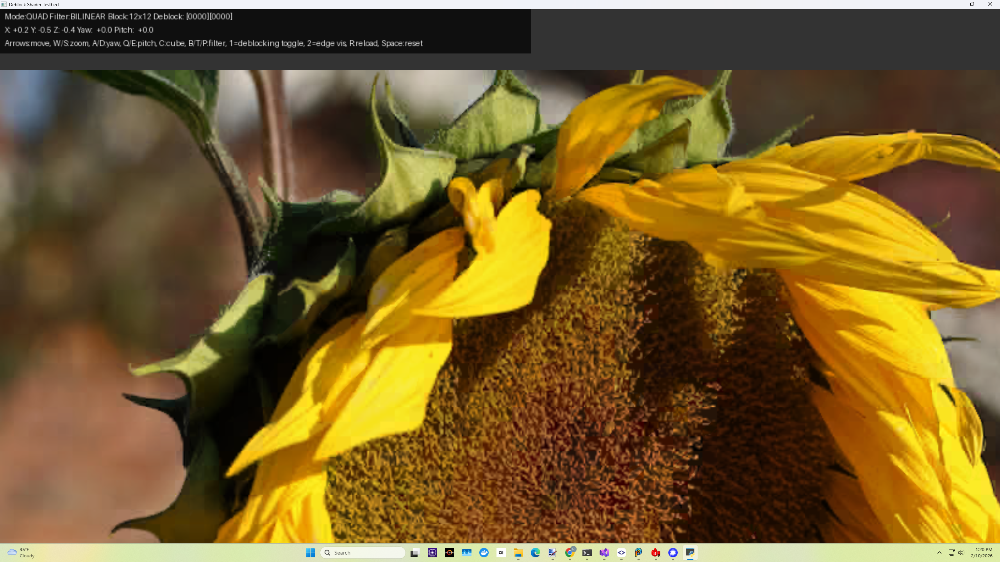
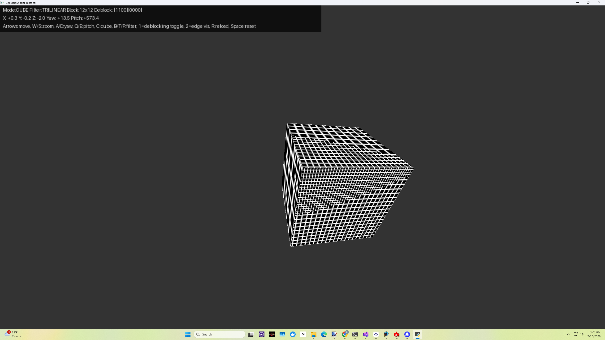
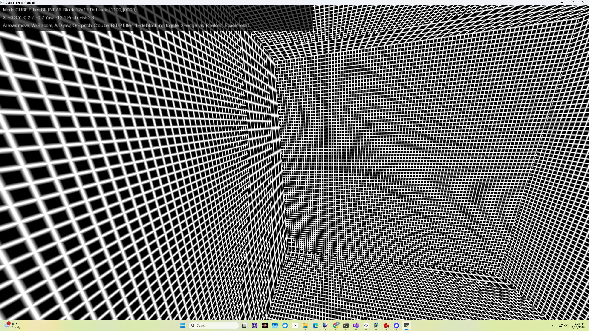

# Python+GLSL Shader Deblocking Sample

*Block boundaries are predictable.*

This sample demonstrates how to use a simple pixel shader to greatly reduce
ASTC texture block artifacts, which can be quite noticeable when the block size goes
beyond roughly 6x6. The basic idea: instead of always sampling the texture using 
a single tap, you instead sample the texture either one time or X times with a simple low pass filter,
depending on whether or not the sample location is near a block edge. The multiple filter taps around 
the center sample blur across block boundaries of ASTC compressed textures. There are two independent filters, for horizontal and vertical block boundaries.

The example shader is compatible with mipmapping, bilinear filtering, trilinear filtering etc. and is temporally stable. The 
shader smoothly lerps between no filtering and edge filtering, and is mipmap-aware by using the pixel shader derivative instructions. Crucially, the block lattice is evaluated in the *effective mip space*, not in base texture space, which is why it's mipmap-aware. The Python sample shows either a textured quad or a cube, with various controls to move the object, rotate the cube, toggle the deblocking shader on/off, trilinear off/on, etc.

It was written to be as simple as possible. The shader's filter coefficients were picked for more blurring vs. our CPU deblocker to demonstrate the effect, but they are easily tuned. The shader could easily be more optimized (most inner block texels don't need any filtering, but we don't exploit this in the shader with a conditional yet). The idea is compatible with other texture formats with noticeable block artifacts, such as BC1 or ETC1, but 4x4 blocks are so tiny it may be a wash.

It's also possible to add adaptivity to this shader, so it doesn't blindly blur across sharp edges - like we do while 
CPU deblocking before transcoding to BC7 or other LDR texture formats. It's also possible
to add deblocking filter awareness to our ASTC/XUASTC/etc. encoders.

The shader computes the mipmap LOD index assuming an entire mip chain is present (i.e. down to 1x1 texels). If the mipmap chain is incomplete, the developer should clamp the computed mipmap LOD index in the shader. We'll show this in the next update of the sample.

Note: We're amazed the GPU hardware vendors haven't implemented this feature directly in silicon yet. It's extremely useful, even necessary at the largest ASTC block sizes.
This is a form of "GPU texture compression-aware shading" or "GPU format-informed reconstruction".

## Running the Sample

You'll need these Python dependencies to run it:
```
pip install numpy Pillow glfw PyOpenGL
```

You may also want "PyOpenGL_accelerate", and under Linux you may need to also install the system package "libglfw3". We developed this sample under Windows 11.

Run:

```
python testbed.py shader.glsl 12 12 flower_unpacked_rgb_ASTC_LDR_12X12_RGBA_level_0_face_0_layer_0000.png flower_unpacked_rgb_ASTC_LDR_12X12_RGBA_level_1_face_0_layer_0000.png flower_unpacked_rgb_ASTC_LDR_12X12_RGBA_level_2_face_0_layer_0000.png flower_unpacked_rgb_ASTC_LDR_12X12_RGBA_level_3_face_0_layer_0000.png flower_unpacked_rgb_ASTC_LDR_12X12_RGBA_level_4_face_0_layer_0000.png
```

Depending on your setup you may need to use `python3`, or `py -3.12` etc.

Keys: `1` toggles deblocking shader on/off (it defaults to disabled), `2` toggles edges vis (only shows when deblocking is enabled), arrow keys move the object, `W`/`S` keys: forward/backward, `A`/`D`/`Q`/`E`: yaw/pitch, `C`: toggle cube vs. quad. (See the source code remarks for more.)

The shader can be easily simplified to sample the texture less by using less taps. The current shader uses a total of 9 taps, but 5 are possible.

Many variations and optimizations of this basic idea are possible. *Now shader engineers can directly impact memory consumption.* The better your deblocking shaders are tuned or your specific content, the bigger the ASTC block size you can ship. ASTC texture deblocking pixel shader engineering is now a memory optimization skill. 

A simpler, [faster 5 tap filter variant is here](https://pastebin.com/jsF6nUZg). (This shader isn't quite compatible with the currently checked in Python sample, as it uses a new `maxLod` uniform to limit the max fetched mipmap level.) In practice, this simple shader usually looks just as good on most textures/images. ` textureQueryLod()` and `textureSize()` could also be used (with some API's) to simplify the shader further. We're continuing to refine and tune this shader.

---

## Performance

The deblocking shader itself can be put inside a dynamic `if` conditional, so the extra ALU/texture ops only kick in near block edges (which are the minority of samples at ASTC 12x12). The extra sample taps are spatially always near the center sample, so they'll hit the texture cache most of the time. In texture bandwidth bound rendering scenarios (quite common on mobile platforms), the extra ALU ops for deblocking likely come for "free".

*Another perspective: The alternative to not deblocking is ~2x-8x more GPU memory bandwidth (and increased download size) to use smaller ASTC block sizes which have less noticeable block artifacts.*

---

## Screenshots - ASTC 12x12 Block Size

**Disabled:**


**Enabled:**


---

**Disabled:**


**Enabled:**


---

**Disabled:**


**Enabled:**


---

**Block Edge Computation Visualization:**



These screenshots show how the pixel shader computes texture block boundaries in effective mipmap space. To see this visualization, press '1' to enable deblocking, then '2' to enable block edge visualization. Only white areas in this visualization are modified by this shader, leaving the inner block texels unmodified.

**Obviously, it's crucial that the block size passed into the shader via constants exactly matches the ASTC texture's block size, or the filtering applied won't align with the actual ASTC block artifacts.**

---

## Usage and Controls

The sample either renders a single textured quad or a cube. Press 'C' to toggle between the quad and the cube. The '1' key toggles shader deblocking (off by default). The '2' key enables edge visualization, which only works when deblocking is enabled. 

Other keys can be used to move around the quad, rotate the cube etc.:

```
Usage:
    python testbed.py shader.glsl block_w block_h mip0.png mip1.png [mip2.png ...]
    block_w, block_h: Block size in texels (e.g. 8 8 for 8x8 DCT blocks)

Controls:
    Arrows      Move quad left/right/up/down
    W / S       Move closer / farther
    A / D       Rotate yaw (cube mode)
    Q / E       Rotate pitch (cube mode)
    C           Toggle cube / quad mode
    B           Bilinear filtering
    T           Trilinear filtering
    P           Point filtering
    R           Reload shader
	1			Toggle deblocking shader off/on
	2			Toggle edge visualization (only when deblocking active)
    3-4         Toggle shader const0.x/y/z/w (0 <-> 1)
    5-8         Toggle shader const1.x/y/z/w (0 <-> 1)
    Space       Reset to initial state
    Esc         Quit
```

---

## Credits

The included sunflower image is in the CC0/Public Domain, and was downloaded from here:

https://www.publicdomainpictures.net/en/view-image.php?image=756601&picture=large-yellow-sunflower

"License: CC0 Public Domain - Lynn Greyling has released this “Large Yellow Sunflower” image under Public Domain license."

