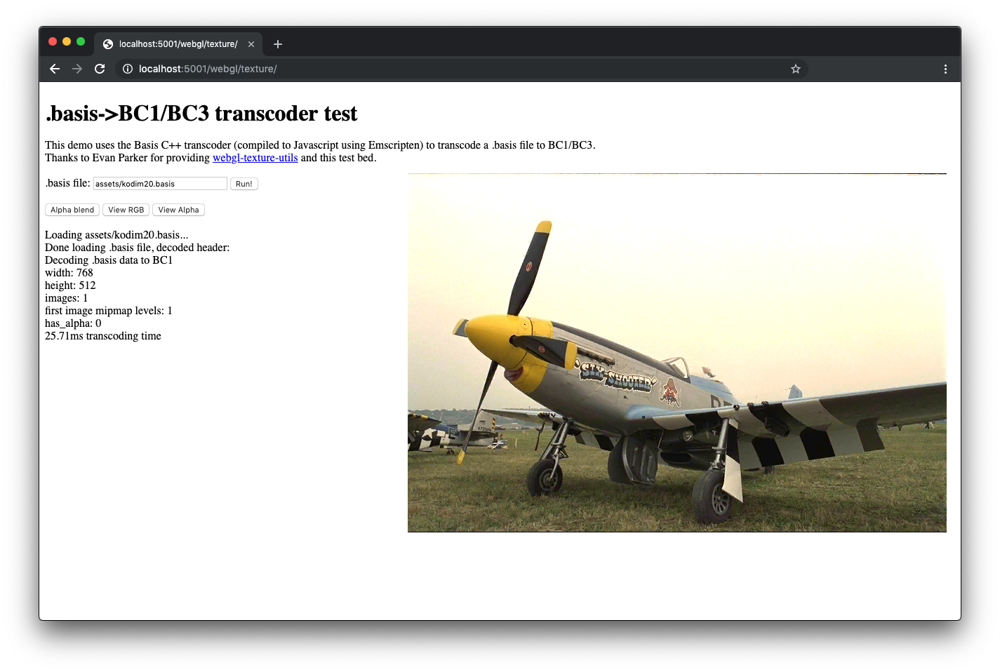
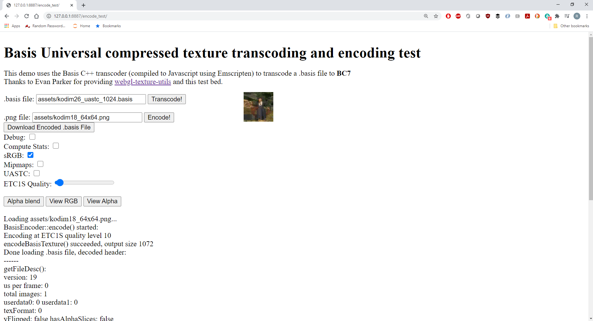

# WebGL Examples

Requires WebAssembly and WebGL support.

## Texture

(Note the Live texture demo hasn't been updated to the latest release yet.)

Renders a single texture, using the transcoder (compiled to WASM with emscripten) to generate one of the following compressed texture formats:

* ASTC
* BC1 (no alpha)
* BC3
* ETC1 (no alpha)
* PVRTC

On browsers that don't support any compressed texture format, there's a low-quality fallback code path for opaque textures. Note that the fallback path only converts to 16-bit RGB images at the moment, so the quality isn't as good as it should be.



## glTF 3D Model

glTF 2.0 assets support Basis Universal compression in KTX2 texture containers, defined in the glTF 2.0 extension [`KHR_texture_basisu`](https://github.com/KhronosGroup/glTF/tree/main/extensions/2.0/Khronos/KHR_texture_basisu).

Further reading:

- [Artist guide to KTX2 and Basis Universal](https://github.com/KhronosGroup/3D-Formats-Guidelines/blob/main/KTXArtistGuide.md)
- three.js documentation for [GLTFLoader](https://threejs.org/docs/?q=gltfl#examples/en/loaders/GLTFLoader) and [KTX2Loader](https://threejs.org/docs/?q=ktx2#examples/en/loaders/KTX2Loader)


## Compressor (encode_test)

This demo shows how to use the compressor from JavaScript. To use it, select a .PNG file then hit the "Encode!" button. The compressor will dynamically generate a .basis file in memory which will then be immediately transcoded and displayed. Hit the "Download!" button to locally download the generated .basis file. 

To view the compressor's textual debug output, open your browser's developer debug console (under Developer Tools in Chrome) and enable the Debug checkbox before hitting the "Encode!" button. Multithreading is not currently supported when the compressor is compiled to WebAssembly, so compression will be slower than using the stand-alone command line tool.



## Testing locally

See [how to run things locally](https://threejs.org/docs/#manual/en/introduction/How-to-run-things-locally), or (with [Node.js](https://nodejs.org/en/) installed), run:

```
npx serve
```

The console will display a `localhost` URL for local testing, and (on supported WiFi networks and devices) may also display an IP address accessible by other devices on the same network. Note that mobile devices must support WebAssembly to run this demo. Learn more about [remote debugging your android devices](https://developers.google.com/web/tools/chrome-devtools/remote-debugging/).

Alternately, use [Web Server for Chrome](https://chrome.google.com/webstore/detail/web-server-for-chrome/ofhbbkphhbklhfoeikjpcbhemlocgigb), browse to your local "webgl" directory, and then select 127.0.0.1:8887 under "Web Server URL(s).
